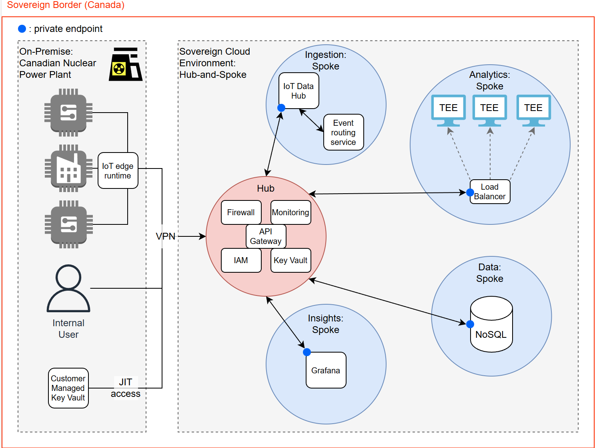

# CST8912 Cloud Architecture PoC: Sovereign Nuclear Monitoring System

Alice Yang, Elizabeth Kaganovsky, Justin Bélanger, Sebastien Dunne, Victor Glasser

School of Advanced Technology, Algonquin College

CST8912: Cloud Services Architecture

Ragini Madaan

December 10, 2025

## Introduction

Nuclear power plants require strict operational safety and regulatory
compliance. These facilities generate complex telemetry data from IoT sensors
that monitor metrics like fission rate, reactor conditions, cooling systems,
and radiation levels. Historically, monitoring systems have been hosted
on-premises to maintain control and security. While this approach ensures
sovereignty, it limits scalability and other cloud-native capabilities that the
industry would want to leverage in the current day.

Cloud computing allows for real-time telemetry ingestion and autoscaled
workloads for predictive analytics. However, cloud adoption introduces
challenges of data sovereignty, regulatory compliance, and security for highly
regulated industries such as nuclear energy. Sovereign cloud principles ensure
that sensitive workloads and data remain within national borders and protected
from foreign interference or access.

In Canada, compliance requirements enforced by the Canadian Nuclear Safety
Commission (CNSC) mandate require “independent, transparent and efficient
regulatory oversight of Canada’s nuclear sector.” (_Canadian Nuclear Safety
Commission - Mandate_, 2025) As a result, it is critical that cloud
infrastructure that monitors sensitive data such as that of a nuclear power
plant (as is the case with Athena, a Canadian CSP that provides service to
Canadian Nuclear Labs) enforces strong sovereign controls combined with secure
networking architecture.

## Objective

The objective of this proof of concept (PoC) is to design a highly secure
sovereign cloud architecture for nuclear IoT telemetry monitoring. As a result,
Microsoft Azure or AWS service names are used for clarity and to provide
reference service capabilities. The actual PoC assumes that the service is
provided by a hypothetical Canadian cloud service provider. Requirements for
the architecture include complying with Canadian data sovereignty/residency,
encrypted telemetry ingestion from the nuclear facilities, secured analytics in
Trusted Execution Environments (TEE), RBAC with just-in-time privileges, all
implemented within a Zero Trust hub-and-spoke private network. Data
sovereignty/residency involves ensuring that all data and workloads remain
under Canadian jurisdiction, within Canadian regions like Canada Central and an
optional alternative (such as Canada East) for disaster recovery purposes (and
the possibility of future expansion). The architecture secures ingestion
through encrypted TLS channels and private endpoints between services. Metrics
and analytics data in processing during analytics is guaranteed confidentiality
through TEE environment VMs. The hub-and-spoke network should be completely
private without egress to the internet. Finally, the RBAC should follow
least-privilege principles and leverage just-in-time rules for highly
privileged roles or permissions.

## Network Topology: Hub-and-Spoke

As previously mentioned, the PoC leverages a hub-and-spoke network topology to
support Zero Trust security practices, isolate processes and data to minimize
damage in case of breach, and centralize shared services for all processes.

_Figure 1. Hub-and-spoke network topology_

The overall network features VPN tunnels from the on-premises nuclear power
plant to the sovereign cloud ecosystem. There are no public endpoints to
maximize isolation of services and security.

The hub virtual network (VNet) includes the shared services of the firewall
(like Azure Firewall), IAM service (like Entra ID), cloud-based key management
service (like Azure Key Vault), and centralized monitoring and alert service
(like Azure Monitor & Log Analytics). The firewall should be configured to deny
traffic in or out by default, with explicit allows for ingress only to private
endpoints configured to services in the spokes. All traffic between on-prem and
the cloud or between spokes (east-west traffic) will facilitate through the hub
VNet and be verified by firewall filtering each time. The IAM service
distributes RBAC permissions, conditional access based on location, and
explicit just-in-time permissions when required for highly privileged behavior.
The cloud-based key vault is integrated with the IAM service and the customer
managed keys stored on-premise at the power plant data center to generate
temporary keys for decrypting the sensitive metrics data to analyze in the
encrypted VM set. Finally, the centralized monitoring service handles tracking
performance, logs or alerts for auditing and responding to critical events in
the ecosystem.

There are four spoke VNets in the network: ingestions, analytics, data, and
dashboard. Each spoke VNet contains a distinct, coupled workload and segments
the network, complying with the “assume breach” principle of Zero Trust wherein
any attack on a spoke in the network would be halted by the distinct
partitioning of workloads. (Lanfear, 2025)

The ingestion spoke has a service that handles centralized, encrypted over TLS
(via x.509 certificates) IoT data ingestion (like Azure IoT Hub) for all the
sensors in the power plant. Depending on the raw telemetry collected, events
will be triggered by the event routing service (like Azure Event Grid) within
the same spoke, to flag further downstream workloads back through the hub VNet.

The analytics spoke contains a set of confidential compute VMs with TEE
enclaves, where CPU is encrypted at the hardware level for only the power
plant’s CMKs to decrypt. As a result, only the organization themselves can
observe or access analytics data in processing.

The data spoke contains NoSQL database(s) for storing processed analytics data
required for visualization, archival, auditing, or other business purposes.

The dashboard spoke contains a visualization service hosting Grafana to view
real-time telemetry and analytics from processed data to glean any historical
patterns or insights on the power plant’s metrics. The dashboard application is
accessible only to an authorized, on-premises internal user via VPN. Overall,
all services within the network are only accessible via private endpoints
configured to each adjacent service down the workflow to maximize security and
to enforce defense in depth, preventing any cascading breach incident.

### Alternative Consideration: Point-to-Point

A common alternative to the hub-and-spoke model is point-to-point (P2P) network
topology, defined by all nodes in the network being interconnected and placed
within the bounds of a shared VNet. While convenient and compliant with P2P
makes for a poor choice for this application. Most notable of the drawbacks are
that of lax security--a single VNet’s blast radius (that is, the scope of
damage coming from a single misconfiguration or security breach) encompasses
every service within. With multiple VNets, one becoming compromised does not
implicitly affect the surrounding VNets, leaving breaches isolated and
minimizing damage. Furthermore, peered VNets are connected over the Microsoft
backbone network and shielded from exposure to the greater internet, and can
have their safety further bolstered by individualized network security groups
that keep them explicitly unable to access one another without traversing the
secure hub, a level of security impossible to meet with a P2P topology. To note
is that while limited in size and possibly lacking the robust global backbone
networks of major global CSPs, the data transfer of this PoC does not leave
Canada and as such the simple backbone of a sovereign provider will likely be
perfectly sufficient.

While P2P networks have benefits, these are not significant enough to offset
the security threat they pose. Networks using a single VNet are often touted as
less costly due to the avoidance of the fees associated with cross-VNet data
transfers, but these fees are often so marginal (quite literally pennies per
Gigabyte (Virtual Network Pricing | Microsoft Azure, n.d.)) that they are not
an issue beyond traffic-heavy use cases such as global ecommerce applications,
and as such will be of little issue to the comparatively meagre, predictable
data flow of real-time nuclear monitoring. Many also assume that a single VNet
hosting all services provides lower latency than multiple peered VNets, and
therefore may be preferable for real-time applications. Microsoft however
states that peered VNets in the same region have the same latency as a single
VNet (_Hub-Spoke Network Topology in Azure - Azure Architecture Center_,
2025)--while this is not necessarily true of smaller, sovereign providers and
excludes inter-region traffic, it can be assumed that due to the limited
distance travelled by the data (often from the site to the nearest data
centre), latency gains may be marginal enough to not pose much issue,
especially with the ability to offload the microsecond-sensitive monitoring
requirements to the edge IoT runtime.

Ultimately a hub-and-spoke network topology proves to be preferable for the
nuclear monitoring application covered by this PoC over a P2P topology due to
the added security, despite extremely marginal losses in the realms of cost and
performance.

## Architecture Style: Event-driven Architecture

_Figure 2. Event-driven Architecture_

Our event-driven architecture is divided into six key sections: source,
collection, ingestion, transformation, storage, and insights.

The source consists of two components. The first component is the subject that
is being measured by the IoT devices. In this case, this is the location where
the measurements are being taken, such as the fusion reactor. The second is the
array of thermometers, dosimeters, and other IoT devices that measure the
conditions in the fusion reactor (Building Event-Driven Architectures with IoT
Sensor Data | AWS Architecture Blog, 2022).

During collection, the IoT device data is collected with the help of an
open-source IoT edge runtime. The IoT edge runtime is responsible for filtering
and aggregating data and sending this data to the cloud (Building Event-Driven
Architectures with IoT Sensor Data | AWS Architecture Blog, 2022). This allows
for device data to be cleaned and aggregated locally, which can significantly
reduce the amount of data sent to the cloud and reduce bandwidth costs (What Is
Azure IoT Edge, 2025).

During ingestion, the aggregated data moves to the cloud through a secure VPN
and enters the IoT Data Hub. This stage also includes an event routing service,
which sends requests to on-prem systems to take any critical actions that the
IoT data reveals is necessary, such as adjusting the temperature if it gets too
high (_Azure IoT Hub and Event Grid - Azure IoT Hub_, 2025).

Moving onto data transformation, data is sent through a stream processing tool,
which transforms and analyzes the data once more (Building Event-Driven
Architectures with IoT Sensor Data | AWS Architecture Blog, 2022).

For storage, the processed data is sent to a NoSQL database. Lastly, for
insights, Grafana is used to visualize the data for users to view and take
actions based on (Building Event-Driven Architectures with IoT Sensor Data |
AWS Architecture Blog, 2022).

## Alternative Considerations in Architecture

There are many varieties of cloud architecture designed for a variety of use
cases, the most popular of which being N-Tier, web-queue-worker, microservice
and event driven, which all differ significantly. Each one boasts strengths and
weaknesses, though thankfully one easily triumphs above the rest for this
situation.

The N-tier style of architecture is an antiquated configuration that predates
the cloud, popularized well before the more modern microservice paradigm came
into common use. This approach to architecture involves splitting an
application into multiple tiers (typically three but any are possible, hence
the eponymous “N” in “N-tier”), where each tier handles a specific workload.
Most typically, the tiers are the classic front end, back end and data, though
some systems may have more tiers for additional workloads (N-Tier Architecture
Style - Azure Architecture Center, n.d.). A critical issue with this
architecture is that the tiers are often tightly coupled, meaning that a change
in one tier affects the behaviour of the others. Similarly, issues may
propagate through the tiers due to the aforementioned tight coupling. While
perfectly suitable for migrating older systems requiring rapid cloud rehosting,
N-tier has been proven antiquated and not preferable for modern applications,
especially one such as the application detailed in this PoC, where robustness
is necessary to prevent disaster. For this reason, N-tier has been excluded
from the pool of options for application architecture.

The Web-Queue-Worker (WQW) style of architecture is similar to N-Tier in that
it boasts the stricter division of workloads as a main feature. However, where
N-Tier utilizes a back end, the WQW features a worker that handles the business
logic with a message queue positioned between the worker and additional
workloads. This approach features looser coupling between workloads than that
of the N-Tier architecture, alleviating the issue of system collapse in the
event of a failure in one level. In WQW, communications can continue between
workloads not explicitly affected by the failure, with messages stored in a
queue until consumption can resume when the affected workload is brought back
online. While more appealing to the use case than N-Tier, it is important to
note that WQW is better suited to deployments that require simpler
architectures and systems with smaller data transfers due to the risk of
consistency errors where messages may be duplicated or remain unsent in the
event of issues with the ingress service (Web-Queue-Worker Architecture Style -
Azure Architecture Center, n.d.). Due to the sensitivity of the involved data,
this architecture style does not make an optimal fit for nuclear monitoring,
where data integrity is of critical importance and erroneously duplicated or
deleted messages can hide disaster, or falsely signal one in otherwise
innocuous conditions, and as such is excluded from the options for this PoC.

A more modern and cloud-friendly approach to architecture used in many
applications today is that of microservices, which involves a workload being
fragmented into a slew of smaller components that function independently. This
approach promotes further decoupling over WQW, allowing individual services to
scale to meet application needs, as well as fail without the risk of errors
catastrophically propagating throughout the system. Additionally, microservices
promote a decentralized model of development where teams can develop
microservices in isolation, and update or replace them without requiring
consideration of anything but data ingress and egress, as the internal
behaviour of each service is not affected by the behaviours of other services
(_Microservice Architecture Style - Azure Architecture Center_, 2023). While
otherwise a suitable choice for most applications, microservices architecture
is excluded as an option for several reasons. Among them being concerns arising
from a lack of strongly centralized governance for development --while it is
true that this can be mediated through governance and policy, the added layer
of management does not come implicitly through smart architecture choice and
requires external monitoring to keep development in line. Additionally, due to
the wealth of granular services, network congestion can easily arise,
especially in the event of uneven scaling between services. Significant latency
can also arise from this as interservice chains of dependencies grow beyond
acceptable levels and require messages to be routed through and processed by
multiple microservices. As detailed above, a well-organized system with minimal
latency is a necessary requirement for this system. As a result, microservices
architecture is not preferred for this PoC.

Thankfully, there is an architecture which well fits the requirements of this
application, known as Event-Driven. Similar to microservices, Event-Driven is
defined by an application with workloads broken down into smaller, loosely
coupled chunks--though where communication in a microservice-based architecture
requires direct messaging between services, often crowding the overarching
application with throngs of inter-service traffic, Event-Driven architecture
uses a Pub/Sub model with a central node that mediates communication between
components. In a Pub/Sub model, clients or workloads can subscribe to a
specific topic and receive all messages relating to that topic. Event-driven is
greatly preferable for real-time applications due to the simplified
organization of event producers (which generate streams of events) and
consumers (who listen for and process these events) (_Event-Driven Architecture
Style - Azure Architecture Center_, n.d.). This model features many of the
benefits of the previously excluded architecture such as loose coupling and
fine control over the development of each system component, but also allows for
stronger real-time capabilities, where events are written to a log and consumed
by multiple services with minimal latency. This allows for the monitoring
application to rapidly react to live IoT metrics and correct itself easily by
having different subscriptions for each regulatory system. It also allows for
far safer error handling with minimal need to worry about complete system
crashes. Additionally, the lack of tight coupling means that additional
monitoring subsystems can be developed and added with no additional latency
added to the system due to the lack of point-to-point integrations. For these
reasons, Event-Driven architecture is vastly preferable for this use case.

## Governance

### Governance: Sovereign Controls

As discussed in prior reports, sovereign controls in the governance layer of
the cloud ecosystem serves as the backbone of what makes the cloud architecture
sovereign. The controls for this PoC are guided largely by the regulatory
requirements outlined by the Canadian Nuclear Safety Commissions (CNSC) in the
REGDOC-3.1.1 document.

These policies should be applied at the tenant root organizational
unit/management group level to ensure that all services inherit the same
enforcement. The critical technical controls for this PoC is as follows:

| Sovereign Control | Details |
| -------------- | --------------- |
| Key management | - External: on-prem, primary store for customer managed keys - Managed: on cloud for services that need it; any key-based operations require just in time access from on-prem |
| Encryption | - At-rest: confidential compute for analytics workload and customer managed keys to access all data storages - In-transit: IoT devices payloads to cloud secured by TLS
| Data sovereignty/residency protection | Deny non-Canadian regions via policy |
| Private network | - No public IP, all access via private endpoints - Deny VNet peering between spokes & enforce spoke-hub-spoke traffic filtered through firewall in hub - Require confidential compute on analytics workloads |
| Access Management | - JIT: any access to data (disks, storage etc) require explicit and temporary approval via PIM (just in time admin access) - Read/write: Only ingestion/analytics spokes get write perms, beyond that should be read only  - RBAC: least-privilege role permissions (Lanfear, 2025)
| Audit Management| - Read-only tamper proof/evident logs in NoSQL |

_Figure 3. Sovereign controls table_

### Governance: Cybersecurity Standards

The cybersecurity standards are driven by Zero Trust principles, ensuring that
every request is explicitly verified before granting access. This approach
meets CNSC requirements for detecting, reporting, and mitigating security
breaches. The previously outlined governance controls enforce strict
segmentation between workloads by isolating spokes, mandating private
endpoints, denying access from non-Canadian regions, and requiring JIT
privileged access. By combining these controls, the architecture significantly
reduces attack surfaces and mitigates potential consequences of breaches as
outlined in REGDOC-3.1.1. These measures collectively support a robust
governance system, enabling power plants to respond to security actions
effectively while maintaining accountability for all operations.

Section A.27 under REGDOC-3.1.1 specifies that any actual or attempted security
break must be reported immediately through a preliminary report, followed by a
detailed report outlining the incident and corrective actions taken
(_REGDOC-3.1.1, Reporting Requirements for Nuclear Power Plants, version 3_,
2025). The cloud architecture supports this requirement by centralizing all
security logs in a tamper evident data lake, ensuring no unauthorized
modifications go undetected. The real-time IoT stream analytics are configured
with automated workflows to immediately notify the security operations team,
triggering rapid response measures. All forensic audit trails are stored within
Canadian sovereign boundaries, ensuring that sensitive operational data remains
under national control, which preserves both regulatory compliance and
sovereign integrity.

Section 3.4, Quarterly report on operational security, mandates the structured
submission of security related events and metrics every quarter (_REGDOC-3.1.1,
Reporting Requirements for Nuclear Power Plants, version 3_, 2025). To meet this
requirement, the governance layer enforces mandatory logging for all access to
confidential compute environments, encryption keys, and sensitive datasets. It
also automates the retrieval of the read-only audit logs and provides metrics
that summarize attempted breaches, denied network connections, and any
privilege escalation attempts. By providing this level of detailed operational
reporting, the architecture ensures ongoing visibility into the security state
of the environment.

### Governance: Sovereign Cloud Standards

Sovereign cloud standards impose strict controls on the handling of
information, such as nuclear telemetry, operational power plant data, equipment
health readings, and any analytics created from the data. Under REGDOC-3.1.1
A.2: transfer or disclosure of prescribed information, and A.31: safeguards,
this data must remain exclusively within Canadian jurisdiction and must never
be exposed to unauthorized systems, operators, or foreign entities. These
requirements govern the collection, transmission, processing, analysis,
retention, and destruction of data (_REGDOC-3.1.1, Reporting Requirements for
Nuclear Power Plants, version 3_, 2025). The PoC architecture enforces this by
applying regional restriction policies that block deployment outside Canada’s
sovereign borders and by ensuring that data never traverses public networks.
All ingestion, transformation, and communication paths are routed through
private endpoints and networks, preventing accidental or malicious egress.
These controls collectively ensure that data residency, data sovereignty, and
regulatory compliance are maintained at all times.

To strengthen protection at the operational level, the architecture implements
a separation between on-premises key ownership and cloud key usage. All
customer managed keys remain exclusively on-premises, under full Canadian
controlled custody. These keys are never uploaded or replicated to the cloud.
Cloud services instead rely on derived keys that are generated and released
through tightly governed JIT workflows. This separation ensures that even if a
cloud component were compromised, the impact is confined to the temporary key
in use at the moment (Robertson, 2025). Confidential compute is enforced for
workloads so that even privileged cloud operators cannot inspect memory,
intermediate values, or data in use. All IoT sensor streams, analytics outputs,
and audit logs remain fully isolated within Canadian sovereign infrastructure,
protected by read-only audit trails and access policies. Together, these
measures enforce compliance with the safeguards and disclosure controls
mandated under A.2 and A.31.

## IoT Data Stream Metrics

Operational oversight ensures safe and consistent power plant operations by
leveraging telemetry and performance indicators derived from IoT sensor data
streams. The cloud architecture is designed to provide structured monitoring
that aligns with both quarterly and annual reporting expectations. Below is a
table of the metrics required for reporting obligations outlined in
REGDOC-3.1.1:

Operational Area | Metric | CNSC Reporting Requirement |
| -------------- | --------------- | --------------- |
| Pressure Boundary Monitoring | Structural integrity anomalies, pressure deviations, sensor patterns, & temperature data from pipes and vessels | - A.10 Failure, degradation or weakening of structures, systems and components (SSC) - 3.2 Quarterly report on nuclear power plant pressure boundaries |
| Environmental Monitoring | Effluent flow rates, activity concentrations (Becquerels), and emission levels for at least Tritium (HTO/HT), Carbon-14, and Noble gasses | - 3.6 Annual report on environmental protection - B.5 Environmental Releases – Radiological |
| Chemistry Control | Chemistry index scores (Oxygen, pH levels, Chloride, Fluoride, Sulfate), compliance tracking for both GSS (guaranteed shutdown state) and non-GSS | - B.19 Chemistry Index - B.20 Chemistry Compliance Index (non-GSS and GSS) |
| Safety Reliability Monitoring | Automated testing of safety systems (SDS1/SDS2), Emergency Core Cooling (ECC), Containment systems | - B.17 Safety system test performance |

_Figure 4. IoT Data Stream Metrics_

## Conclusion

The proof of concept for the Sovereign Nuclear Monitoring System demonstrates
that a secure, compliant cloud architecture is achievable through sovereign
controls, data encryption, and hub-and-spoke network segmentation. By
guardrailing telemetry streams and processing within Canadian sovereign
borders, and leveraging Trusted Execution Environments to encrypt analytics
workloads, the architecture successfully bridges the gap between the
operational scalability of the cloud and the stringent safety and regulatory
requirements of the nuclear energy sector. The implementation of Zero Trust
principles and just-in-time access management also ensures that the system
meets governance standards mandated by the Canadian Nuclear Safety Commission
(CNSC) under REGDOC-3.1.1.

Furthermore, the integration of real-time IoT telemetry analytics enables
automated alerting and reporting for operational indicators such as pressure
boundary integrity, radiological releases, and chemistry compliance. Sovereign
cloud computing enables nuclear facilities to modernize their infrastructure
towards bleeding-edge event-driven workflows, while maintaining the absolute
control and national security oversight required. This PoC serves as a high
level blueprint for similarly regulated industries looking to adopt
cloud-native capabilities without compromising on data residency, sovereignty,
and comprehensive control over data.
